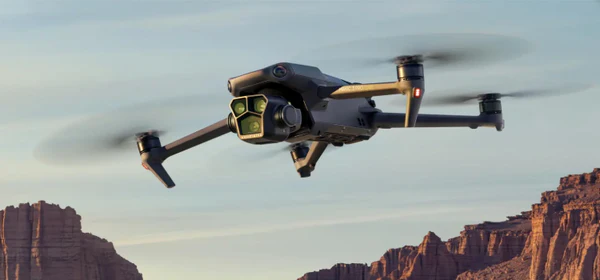

# Droner - Premium Drone Service Website



## Project Overview

Droner is a sophisticated, modern website for a premium drone service company. The website features a futuristic design with glassmorphism effects, 3D animations, and interactive elements that create an immersive user experience. The site showcases various drone services, case studies, and company information in an elegant, professional manner.

## Features

- **Interactive 3D Elements**: Floating icons and elements with parallax effects
- **Sophisticated UI Design**: Glassmorphism, neon accents, and futuristic aesthetics
- **Responsive Layout**: Optimized for all device sizes
- **Comprehensive Service Pages**: Detailed information about various drone services
- **Interactive Case Studies**: Showcase of successful drone projects
- **Careers Section**: Information about joining the Droner team
- **FAQ Section**: Interactive expandable questions and answers
- **Contact Options**: Multiple ways to get in touch with the Droner team

## Pages

1. **Home Page**: Features a 3D drone model, service highlights, and company overview
2. **Services**: Detailed information about aerial photography, videography, mapping, and more
3. **Fleet**: Showcase of drone models with 3D visualizations
4. **Case Studies**: Portfolio of successful drone projects
5. **Booking**: Interactive form for scheduling drone services
6. **Careers**: Job opportunities and company culture information
7. **FAQ**: Common questions and detailed answers
8. **Contact**: Multiple contact options and form

## Technologies Used

- **HTML5**: Modern semantic markup
- **CSS3**: Advanced styling with animations and effects
- **JavaScript**: Interactive elements and animations
- **Three.js**: 3D drone model visualization
- **Font Awesome**: Icon library
- **Google Fonts & Fontshare**: Typography

## Design Elements

- **Color Scheme**: Dark background with neon blue accents (#00ccff)
- **Typography**: 
  - Headings: Satoshi (bold, clean sans-serif)
  - Body: Space Grotesk (modern, readable)
  - Accents: General Sans & Outfit
- **Visual Effects**:
  - Glassmorphism cards and panels
  - Subtle background textures
  - Floating 3D icons with parallax effects
  - Gradient overlays and shadows

## Setup and Installation

1. Clone the repository:
```
git clone https://github.com/DIP-KARMA/Drone.git
```

2. Open the project in your preferred code editor

3. Launch the website by opening `index.html` in a web browser or using a local server:
```
# Using Python's built-in server
python -m http.server
```

## Future Enhancements

- Integration with a backend for form submissions
- Dynamic content loading with a CMS
- Enhanced 3D models with interactive controls
- User accounts for booking management
- Drone flight path visualization tools

## Credits

- 3D Models: Three.js library
- Images: Unsplash and stock photography
- Icons: Font Awesome
- Fonts: Google Fonts and Fontshare

## License

© 2025 Droner. All rights reserved.

---

*This project was created as part of a web development portfolio showcasing advanced UI/UX design and front-end development skills.*
